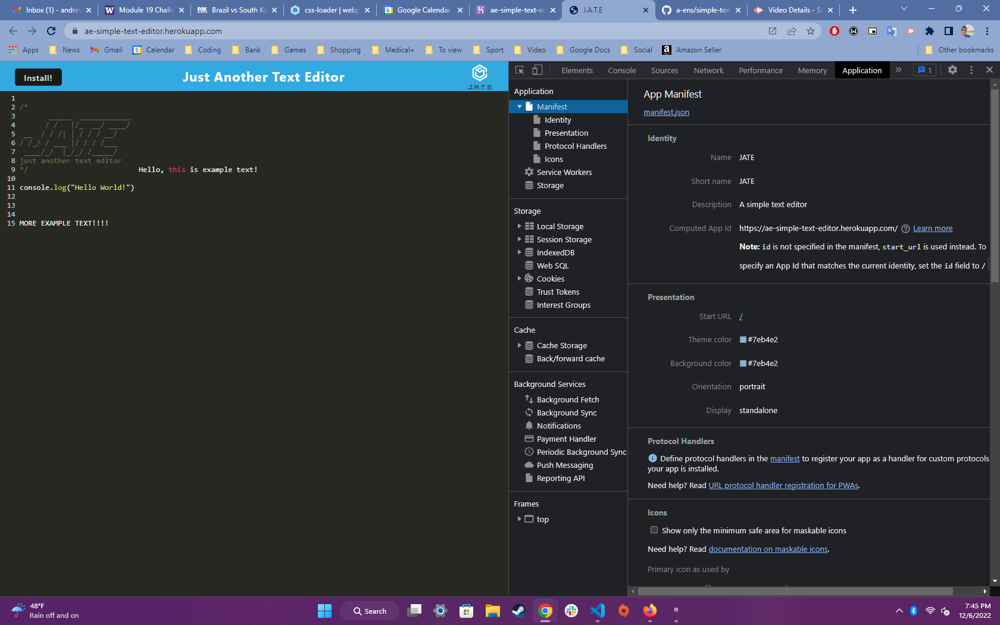
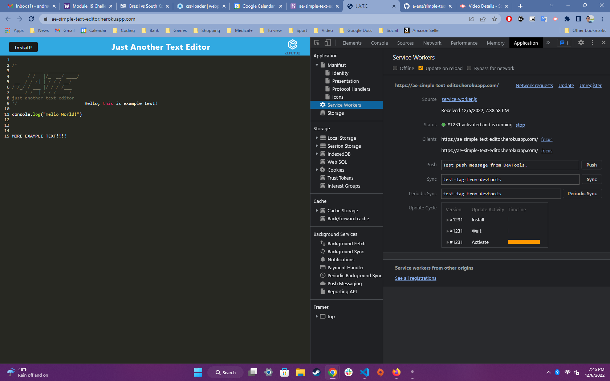
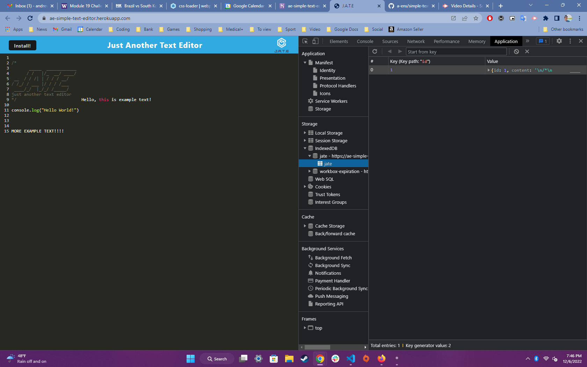

# simple-text-editor

## Demonstration of the App

The following animation demonstrates the application functionality:

The following image shows the application's `manifest.json` file:

The following image shows the application's registered service worker:

The following image shows the application's IndexedDB storage:

